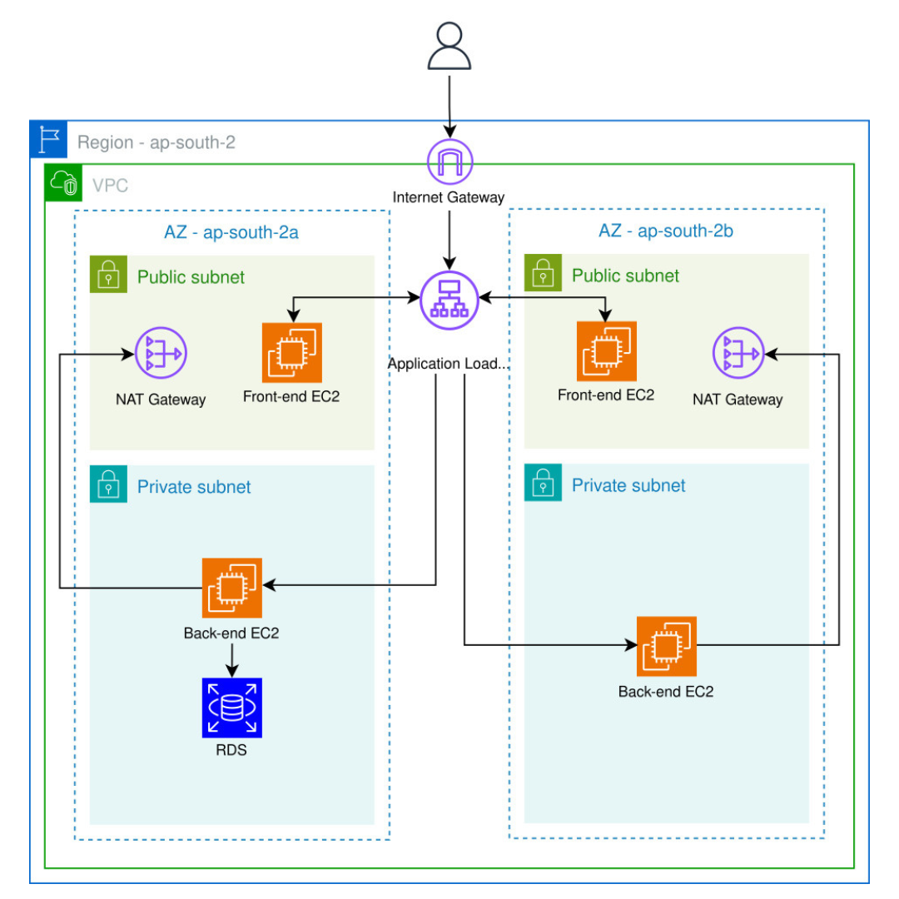

# AWS 3-Tier Web Application Architecture

This repository documents the design and deployment of a **production-style 3-tier web application** on AWS using **EC2, Application Load Balancer, and RDS PostgreSQL**, with strict network isolation and security best practices.

---

## Architecture Overview

### High-level flow

